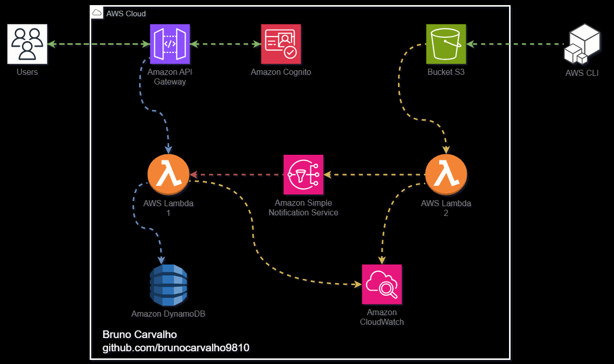

<!DOCTYPE html>
<html lang="pt-BR">
<head>
    <meta charset="UTF-8">
    <meta http-equiv="X-UA-Compatible" content="IE=edge">
    <meta name="viewport" content="width=device-width, initial-scale=1.0">
    <title>Sistema AWS com Terraform</title>
</head>
<body>
    <h1>APP Serverless com Terraform </h1>
    
Este é um sistema AWS construído usando Terraform. Ele consiste em uma arquitetura de microsserviços que processa requisições do usuário, autenticações com Amazon Cognito, armazenamento de dados no DynamoDB, e manipulação de arquivos em um bucket S3.

<h2>Fluxo de Funcionamento</h2>
<ol>
    <li>
        <strong>Requisições do Usuário</strong>:
        <ul>
            <li>Todas as requisições do usuário devem ser feitas para o endpoint <code>/dev/v1/todos</code> do API Gateway da AWS.</li>
            <li>A autenticação é feita pelo Amazon Cognito, onde o token de autenticação deve ser enviado no cabeçalho <code>Authorization</code> como <code>Bearer &lt;token&gt;</code>.</li>
            <li>Após a autenticação bem-sucedida, a requisição é encaminhada para a Lambda <code>lambda1</code>.</li>
        </ul>
    </li>
    <li>
        <strong>Lambda1</strong>:
        <ul>
            <li>A Lambda <code>lambda1</code> é acionada após a autenticação bem-sucedida e recebe os dados da requisição.</li>
            <li>Ela grava os dados no DynamoDB e registra logs no Amazon CloudWatch.</li>
        </ul>
    </li>
    <li>
        <strong>Bucket S3 para Upload de Arquivos</strong>:
        <ul>
            <li>Analistas e desenvolvedores podem fazer upload de arquivos para um bucket S3 usando a CLI ou o console da AWS.</li>
            <li>Quando um arquivo é carregado neste bucket, é disparado um gatilho que aciona a Lambda <code>lambda2</code>.</li>
        </ul>
    </li>
    <li>
        <strong>Lambda2</strong>:
        <ul>
            <li>A Lambda <code>lambda2</code> é acionada pelo gatilho do bucket S3 e recebe os dados do arquivo.</li>
            <li>Ela chama um tópico SNS que, por sua vez, aciona novamente a Lambda <code>lambda1</code>, seguindo o mesmo fluxo descrito acima.</li>
            <li>A Lambda <code>lambda2</code> também registra logs no Amazon CloudWatch.</li>
        </ul>
    </li>
</ol>
<h2>Instruções de Configuração</h2>

Antes de executar o Terraform, siga estas etapas:

<ol>
    <li>
        <strong>Criação de Bucket para o tfstate</strong>:
        <ul>
            <li>Crie manualmente um bucket na AWS para armazenar o <code>tfstate</code> do Terraform.</li>
            <li>O nome deste bucket pode ser alterado no arquivo <code>backend.hcl</code>.</li>
        </ul>
    </li>
    <li>
        <strong>Criação de User Pools no Amazon Cognito</strong>:
        <ul>
            <li>Crie um User Pool manualmente no Amazon Cognito para autenticação.</li>
            <li>Configure o nome deste User Pool na variável <code>service_name</code>.</li>
            <li>Marque as opções <code>Implicit grant</code> e <code>openid</code> para poder utilizá-las durante os testes.</li>
        </ul>
    </li>
    <li>
        <strong>Node.js e Comando Zip</strong>:
        <ul>
            <li>As Lambdas estão escritas em Node.js.</li>
            <li>Para fazer o build, é necessário ter o comando <code>zip</code> instalado. Você pode encontrar instruções de instalação para Windows <a href="https://matteus.dev/zip-for-windows-como-instalar-o-comando-zip/">aqui</a>.</li>
        </ul>
    </li>
    <li>
        <strong>Comandos Terraform</strong>:
        <ul>
        <li>Execute os comandos básicos do Terraform para subir a infraestrutura, passando o arquivo `backend.hcl` como parâmetro, pois ele contém variáveis de configuração.
        </ul>
    </li>
</ol>
<h2>Testes</h2>

Para testar o sistema, utilize a variável <code>api_url</code> que está na saída do Terraform e teste via <a href="https://insomnia.rest/">Insomnia</a>.

 
<h1>APP Serverless with Terraform </h1>
    
This is an AWS system built using Terraform. It consists of a microservices architecture that processes user requests, authenticates with Amazon Cognito, stores data in DynamoDB, and handles file manipulation in an S3 bucket.

<h2>Workflow</h2>
<ol>
    <li>
        <strong>User Requests</strong>:
        <ul>
            <li>All user requests must be made to the <code>/dev/v1/todos</code> endpoint of the AWS API Gateway.</li>
            <li>Authentication is done by Amazon Cognito, where the authentication token must be sent in the <code>Authorization</code> header as <code>Bearer &lt;token&gt;</code>.</li>
            <li>After successful authentication, the request is forwarded to the <code>lambda1</code> function.</li>
        </ul>
    </li>
    <li>
        <strong>Lambda1</strong>:
        <ul>
            <li>The <code>lambda1</code> function is triggered after successful authentication and receives the request data.</li>
            <li>It writes the data to DynamoDB and logs to Amazon CloudWatch.</li>
        </ul>
    </li>
    <li>
        <strong>S3 Bucket for File Uploads</strong>:
        <ul>
            <li>Analysts and developers can upload files to an S3 bucket using the AWS CLI or console.</li>
            <li>When a file is uploaded to this bucket, a trigger is fired that activates the <code>lambda2</code> function.</li>
        </ul>
    </li>
    <li>
        <strong>Lambda2</strong>:
        <ul>
            <li>The <code>lambda2</code> function is triggered by the S3 bucket trigger and receives the file data.</li>
            <li>It calls an SNS topic that, in turn, triggers the <code>lambda1</code> function again, following the same flow as described above.</li>
            <li>The <code>lambda2</code> function also logs to Amazon CloudWatch.</li>
        </ul>
    </li>
</ol>
<h2>Configuration Instructions</h2>

Before running Terraform, follow these steps:

<ol>
    <li>
        <strong>Create a Bucket for tfstate</strong>:
        <ul>
            <li>Manually create a bucket in AWS to store the Terraform <code>tfstate</code>.</li>
            <li>The name of this bucket can be changed in the <code>backend.hcl</code> file.</li>
        </ul>
    </li>
    <li>
        <strong>Create User Pools in Amazon Cognito</strong>:
        <ul>
            <li>Manually create a User Pool in Amazon Cognito for authentication.</li>
            <li>Configure the name of this User Pool in the <code>service_name</code> variable.</li>
            <li>Check the <code>Implicit grant</code> and <code>openid</code> options to use them during testing.</li>
        </ul>
    </li>
    <li>
        <strong>Node.js and Zip Command</strong>:
        <ul>
            <li>The Lambdas are written in Node.js.</li>
            <li>To build, you need to have the <code>zip</code> command installed. You can find installation instructions for Windows <a href="https://matteus.dev/zip-for-windows-como-instalar-o-comando-zip/">here</a>.</li>
        </ul>
    </li>
    <li>
        <strong>Terraform Commands</strong>:
        <ul>
        <li>Execute the basic Terraform commands to deploy the infrastructure, passing the <code>backend.hcl</code> file as a parameter, as it contains configuration variables.
        </ul>
    </li>
</ol>
<h2>Testing</h2>

To test the system, use the <code>api_url</code> variable from the Terraform output and test via <a href="https://insomnia.rest/">Insomnia</a>.

</body>
</html>
